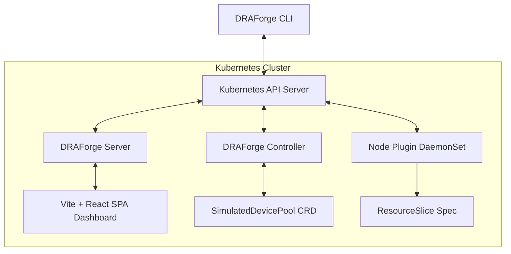

<div align="center">

# DRAForge

**Provider-neutral Kubernetes Dynamic Resource Allocation observability, simulation, and diagnostics for GPU and accelerator workloads.**

Model virtual device pools, inspect `ResourceClaim` and `ResourceSlice` state, and explain why allocations succeed or fail—without requiring physical accelerator hardware or a specific cloud provider.

[](https://github.com/oaslananka/draforge/actions/workflows/ci.yml) [](https://github.com/oaslananka/draforge/actions/workflows/security.yml) [](https://github.com/oaslananka/draforge/releases/latest) [](https://codecov.io/gh/oaslananka/draforge) [](https://scorecard.dev/viewer/?uri=github.com/oaslananka/draforge) [](https://www.bestpractices.dev/projects/13404) [](LICENSE)

[](https://oaslananka.github.io/draforge/) [](docs/compatibility/kubernetes-dra.md) [](go.mod) [](https://github.com/oaslananka/draforge/discussions)

[Documentation](https://oaslananka.github.io/draforge/) · [Quickstart](#quickstart) · [Architecture](docs/architecture.md) · [Compatibility](docs/compatibility/kubernetes-dra.md) · [Operations](docs/operations/guide.md) · [Contributing](CONTRIBUTING.md) · [Governance](GOVERNANCE.md) · [Security](SECURITY.md) · [Support](SUPPORT.md)

[](https://github.com/sponsors/oaslananka) [](https://buymeacoffee.com/oaslananka)

</div>

---

## Why DRAForge?

Kubernetes Dynamic Resource Allocation (DRA) offers fine-grained, driver-controlled accelerator sharing. However, developing and debugging DRA configurations presents a major challenge:
1. **Hardware Scarcity**: Acquiring and configuring dedicated accelerator nodes (e.g., NVIDIA H100 GPUs) for test environments is costly and slow.
2. **Observability Gap**: Native Kubernetes scheduling logs make it difficult to visualize why a resource claim failed to bind to a pod.

DRAForge bridges this gap by providing an evidence-based diagnostics toolkit, a dynamic virtual device simulator, a terminal user interface (TUI), and a real-time interactive relationship graph dashboard.

---

## Features

- **Virtual Device Pools**: Simulate arbitrary hardware profiles (e.g. GPUs, FPGAs, High-Speed NICs) on worker nodes using custom attributes and capacities.
- **Diagnostics Doctor**: Honest, non-mocked configuration analysis (e.g. API availability, version compatibility, ResourceSlice consistency checks).
- **Explain Engine**: Real-time evaluation of selectors, capacity bounds, and node affinity to pinpoint why claims are pending.
- **Bubble Tea TUI**: Professional terminal-based monitor for dynamic pool capacities.
- **Interactive Graph Dashboard**: Real-time SVG visualization of relationships between Pods, Claims, Devices, and Pools.

---

## Architecture



DRAForge components use Kubernetes APIs and Helm contracts rather than provider-specific services. They can run on compatible managed Kubernetes offerings, self-managed clusters, on-premises environments, and local test clusters. Provider-specific Terraform or registry assets in this repository are optional showcases.

---

## Install

### From source (Go 1.26+)

```bash
go install github.com/oaslananka/draforge/cmd/draforge@latest
```

Or clone and build locally:

```bash
git clone https://github.com/oaslananka/draforge.git
cd draforge
task build          # Builds all three binaries into bin/
./bin/draforge version
```

Binaries are also available as pre-built archives from the [GitHub Releases](https://github.com/oaslananka/draforge/releases) page.

## Quickstart

### Quickstart A: Verified local kind cluster

Install Docker, kubectl, Helm, jq, curl, Go, Node.js, pnpm, Task, and the kind version pinned in `tests/install-e2e/kubernetes-versions.json`. Then create the same complete local stack used by the pull-request install gate and keep it for exploration:

```bash
DRAFORGE_INSTALL_E2E_KEEP_CLUSTER=1 task e2e:install-kind
```

Access the dashboard:

```bash
kubectl port-forward svc/draforge-server -n draforge-system 8080:8080
```

Build the local CLI/TUI when needed:

```bash
task build
./bin/draforge doctor
./bin/draforge tui
```

Destroy the disposable cluster when finished:

```bash
kind delete cluster --name draforge-install-e2e
```

### Quickstart B: Optional DigitalOcean Kubernetes (DOKS) Showcase

This provider-specific path is an optional demonstration of DRAForge on one managed Kubernetes service. It is not required for installation, testing, or releases.

> **⚠️ Billable Resources**: This task provisions a live DOKS cluster and DOCR registry on your DigitalOcean account and incurs cloud costs. Always run `task demo:down` when finished to destroy all billable resources.

To deploy the short-lived DOKS showcase:

```bash
task demo:up
```

This task explicitly applies the non-production `values-showcase-docr.yaml` profile, which enables unauthenticated HTTP exposure. It audits resource limits, provisions infrastructure, builds images remotely, installs the Helm release, and outputs the demo URL. Do not use this profile with sensitive clusters or as a production deployment.

A normal Helm install creates only internal ClusterIP services. Production public access requires TLS and an operator-managed OIDC/identity-aware proxy; see the [installation guide](docs/operations/install.md).
The node plugin defaults to isolated `demo` CDI output. Host-integrated kubelet CDI output is an explicit `nodePlugin.outputMode=node` opt-in and fails closed when Kubernetes or the host CDI directory is unavailable.

To tear down the showcase and clean all billable resources:
```bash
task demo:down
```

## Testing

```bash
# Run all unit tests (fast, no race)
go test ./...
# or: task test:unit

# Run unit tests with race detector and coverage
go test -race -coverprofile=coverage.out ./...
# or: task test:race

# Run all Go vet checks
go vet ./...
# or: task vet

# Run frontend unit and integration tests
pnpm --dir web test
# or: task web:test

# Run full Go CI suite (unit + race)
task test
```

The tagged smoke tests run against any compatible Kubernetes cluster that serves the required DRA APIs and are gated by `DRAFORGE_E2E=1`. The `Portable Kubernetes E2E` workflow validates this path on credential-free kind for relevant pull requests and can use a protected short-lived kubeconfig for an external cluster:

```bash
DRAFORGE_E2E=1 go test -tags=e2e ./tests/e2e/... -v
```

## Release

See [docs/release.md](docs/release.md) for the full release process.

### Local snapshot build (no publishing)

```bash
task release:local
# or: goreleaser release --snapshot --clean --skip=docker,sbom,sign
```

### Tagged release

```bash
NEXT_VERSION="${NEXT_VERSION:?set NEXT_VERSION to the intended SemVer, for example 0.3.1}"
release_tag="v${NEXT_VERSION}"
git tag -a "$release_tag" -m "DRAForge $release_tag"
RELEASE_TAG="$release_tag" RELEASE_MAIN_REF=main bash scripts/verify-release-tag.sh
git push origin "$release_tag"
```

Pushing the annotated tag starts the protected release workflow. Published `v*` tags are immutable and are never moved or reused.

---

## CLI Command Reference

| Command | Description | Example |
|---------|-------------|---------|
| `draforge version` | Print binary version and commit details | `draforge version` |
| `draforge discover` | Lists active DRA pools, devices, and resource claims | `draforge discover -o json` |
| `draforge claims` | Summarizes claims status in a formatted table | `draforge claims` |
| `draforge graph` | Generates relationship graph in DOT or Mermaid formats | `draforge graph -o mermaid` |
| `draforge explain` | Troubleshoots why a ResourceClaim is pending | `draforge explain my-pending-claim` |
| `draforge doctor` | Executes cluster and driver diagnostics checks | `draforge doctor` |
| `draforge tui` | Launches the terminal-based monitor console | `draforge tui` |
| `draforge serve` | Runs HTTP API server and Vite dashboard frontend | `draforge serve` |

---

## Documentation

| Resource | Description |
|----------|-------------|
| [Contributing Guide](CONTRIBUTING.md) | Setup, testing, PR expectations, and what not to commit |
| [Security Policy](SECURITY.md) | Vulnerability reporting and security model |
| [Installation Guide](docs/operations/install.md) | Demo and production installation profiles |
| [Operations Guide](docs/operations/guide.md) | Day-two operations, upgrades, metrics, logs, and cleanup |
| [Troubleshooting Guide](docs/operations/troubleshooting.md) | Diagnostics for common issues and pending claims |
| [Maintainer Checklist](docs/maintainer-checklist.md) | Internal review and release processes |
| [Release Process](docs/release.md) | Snapshot and tagged release workflow |
| [Dashboard Guide](docs/dashboard.md) | Web dashboard setup and usage |
| [Simulator Scenarios](docs/simulator-scenarios.md) | Scenario authoring and fault injection |
| [Kubernetes DRA Compatibility](docs/compatibility/kubernetes-dra.md) | DRA API support matrix |
| [Maintainers](MAINTAINERS.md) | Current project maintainers |
| [Governance](GOVERNANCE.md) | Decision-making and roles |
| [Support](SUPPORT.md) | How to get help |

---

## Security Model

DRAForge exposes a read-only dashboard API, but Helm does not expose it externally by default. Read endpoints can reveal operational cluster metadata, so production public access must use TLS and an operator-managed identity-aware proxy. Cluster modifications remain CLI-only and authenticate with the administrator's local `kubeconfig` (see [ADR-0009](docs/adr/0009-public-readonly.md)).

For Kubernetes DRA API support and known limitations, see [Kubernetes DRA Compatibility](docs/compatibility/kubernetes-dra.md).

---

## License

This project is licensed under the Apache License, Version 2.0. See [LICENSE](LICENSE) for the full license text.