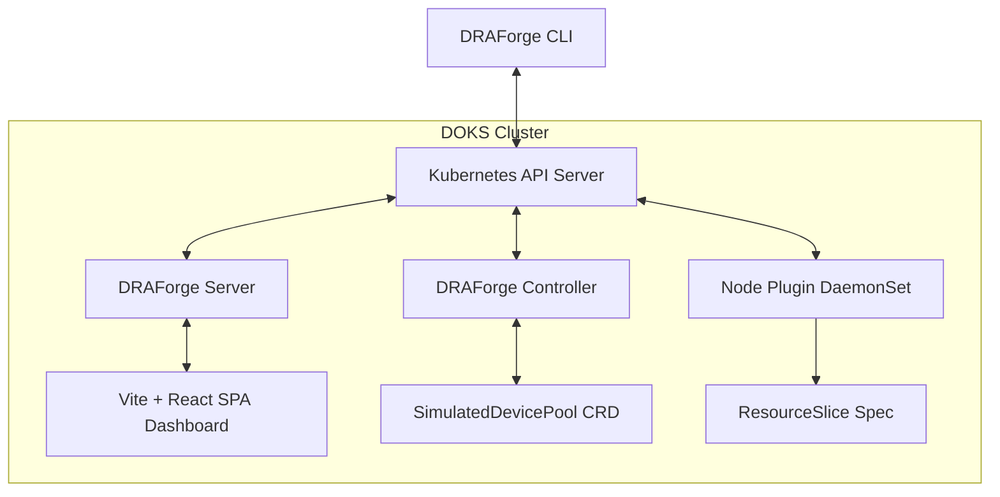

# DRAForge

DRAForge is a Dynamic Resource Allocation (DRA) observability, simulation, and diagnostics platform for Kubernetes. It allows developers and administrators to model, simulate, and diagnose cluster hardware resource allocations (GPUs, edge devices, smartNICs) dynamically—without requiring physical accelerator hardware.

[](https://golang.org)
[](https://www.apache.org/licenses/LICENSE-2.0)
[](https://securityscorecards.dev)

---

## Why DRAForge?

Kubernetes Dynamic Resource Allocation (DRA) offers fine-grained, driver-controlled accelerator sharing. However, developing and debugging DRA configurations presents a major challenge:
1. **Hardware Scarcity**: Acquiring and configuring dedicated accelerator nodes (e.g., NVIDIA H100 GPUs) for test environments is costly and slow.
2. **Observability Gap**: Native Kubernetes scheduling logs make it difficult to visualize why a resource claim failed to bind to a pod.

DRAForge bridges this gap by providing an evidence-based diagnostics registry, a dynamic virtual device simulator, a terminal user interface (TUI), and a real-time interactive relationship graph dashboard.

---

## Features

- **Virtual Device Pools**: Simulate arbitrary hardware profiles (e.g. GPUs, FPGAs, High-Speed NICs) on worker nodes using custom attributes and capacities.
- **Diagnostics Doctor**: Honest, non-mocked configuration analysis (e.g. API availability, version compatibility, ResourceSlice consistency checks).
- **Explain Engine**: Real-time evaluation of selectors, capacity bounds, and node affinity to pinpoint why claims are pending.
- **Bubble Tea TUI**: Professional terminal-based monitor for dynamic pool capacities.
- **Interactive Graph Dashboard**: Real-time SVG visualization of relationships between Pods, Claims, Devices, and Pools.

---

## Architecture



---

## Quickstart

### Quickstart A: Local Kind cluster development
To run DRAForge locally using a Go development environment and a `kind` cluster:

1. **Prerequisites**:
   - Install Go 1.26+
   - Install `kind` (with DRA feature gate enabled)
   - Install `task`

2. **Build and Deploy**:
   ```bash
   task build
   kubectl apply -f deploy/crds/simulateddevicepool-crd.yaml
   kubectl apply -f examples/scenarios/basic-gpu.yaml
   ```

3. **Launch TUI**:
   ```bash
   ./bin/draforge tui
   ```

### Quickstart B: DigitalOcean Kubernetes (DOKS) Showcase
To deploy a live read-only public showcase to DOKS:

```bash
task demo:up
```
This script audits resource limits, runs Terraform provisioners, builds images remotely via Kaniko, installs the Helm release, and outputs the live external URL.

To tear down the showcase and clean all billable resources:
```bash
task demo:down
```

---

## CLI Command Reference

| Command | Description | Example |
|---------|-------------|---------|
| `draforge version` | Print binary version and commit details | `draforge version` |
| `draforge discover` | Lists active DRA pools, devices, and resource claims | `draforge discover -o json` |
| `draforge claims` | Summarizes claims status in a formatted table | `draforge claims` |
| `draforge graph` | Generates relationship graph in DOT or Mermaid formats | `draforge graph -o mermaid` |
| `draforge explain` | Troubleshoots why a ResourceClaim is pending | `draforge explain my-pending-claim` |
| `draforge doctor` | Executes cluster and driver diagnostics checks | `draforge doctor` |
| `draforge tui` | Launches the terminal-based monitor console | `draforge tui` |
| `draforge serve` | Runs HTTP API server and Vite dashboard frontend | `draforge serve` |

---

## Screenshots

Screenshots of the terminal UI and web dashboard are stored in [docs/assets/](file:///c:/Users/Admin/Desktop/OASLANANKA/draforge/docs/assets).

---

## Security Model

DRAForge enforces a read-only public API model. The Go web server exposes read-only endpoints and SSE streams to the dashboard, preventing any write actions or pod execution from the web UI. Cluster modifications (scenario application and fault injections) are strictly restricted to the CLI and authenticated using the administrator's local `kubeconfig` (see [ADR-0009](file:///c:/Users/Admin/Desktop/OASLANANKA/draforge/docs/adr/0009-public-readonly.md)).

---

## License

This project is licensed under the Apache License, Version 2.0. See [LICENSE](file:///c:/Users/Admin/Desktop/OASLANANKA/draforge/LICENSE) for the full license text.